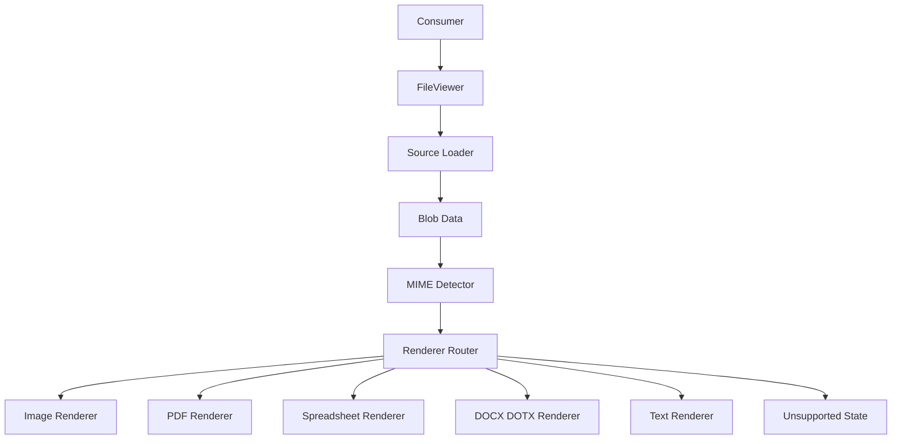
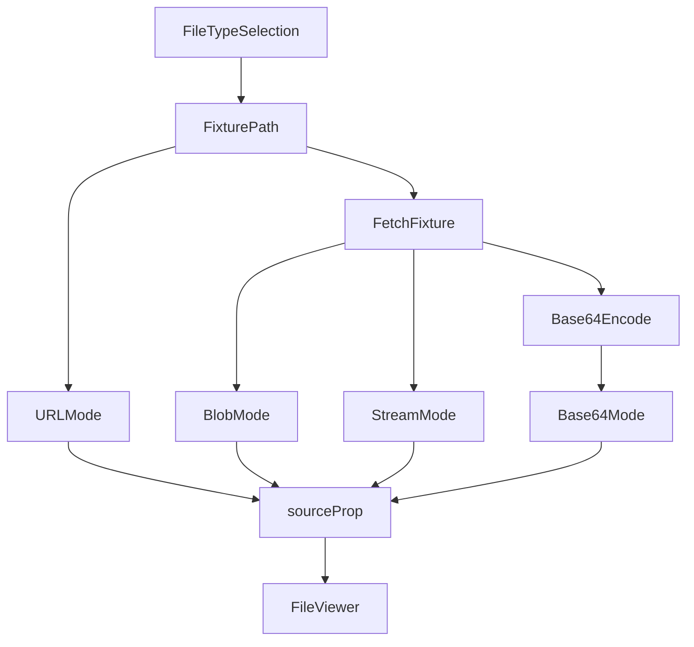

## Goal

Build a React file-viewer package that exports one simple component for images, spreadsheets, PDFs, Word documents, and text-like files.

Supported v1 formats:

- Images: common browser-supported image MIME types
- Spreadsheets: `xlsx`, `xls`, `csv`
- Documents: `pdf`, `docx`, `dotx`
- Text: `txt` and other detected text payloads

PPTX is future work.

## Package Shape

The public package exports:

- `FileViewer`
- Public TypeScript types
- Package CSS

Individual renderers are internal. Consumers do not choose renderers.

```tsx
<FileViewer source={source} />
```

`source` accepts a single raw value:

- `string`
- `Blob`
- `ReadableStream<Uint8Array>`

String sources are auto-classified in this order:

1. Data URL
2. Blob/object URL
3. HTTP(S) URL
4. Base64 string

Invalid or ambiguous strings fail through the normal unsupported/error path.

## Data Flow



All sources are loaded to `Blob` before renderer selection. URLs and streams are buffered before rendering. No renderer is selected from consumer-supplied props.

## MIME Detection

Renderer selection depends on loaded data:

1. Magic byte sniffing
2. Loaded `Blob.type` or HTTP `Content-Type`
3. Text and CSV heuristics

Filename extensions and consumer-provided MIME values are not renderer-selection inputs.

## Renderers

Renderers share a common internal contract:

- receive normalized loaded data
- report loading/ready/error status
- integrate with built-in toolbar state where relevant
- render fallback/error states through the package shell

PDF, spreadsheet, and Word parsing use package-owned bundler-managed workers where worker support is needed. Workers are referenced with package-relative module URLs so consumers do not copy public worker files.

`dotx` uses the DOCX rendering path. Template metadata/actions are not executed.

## UI And Theming

The package uses Tailwind classes and follows the Mithya UI registry pattern.

`@mithya/ui-registry` is a dev-time generator/CLI, not a runtime component library. The package should use the registry to generate or copy the needed design-system primitives into `packages/file-viewer/src`, then ship those primitives as package code.

The package must not import runtime components from `@mithya/ui-registry` or expect consumers to provide `@mithya/ui-repository` as a component peer dependency.

The package ships default CSS generated from a `variables.json` produced by the variables2json Figma plugin. Host apps can override variables with their own generated CSS.

Consumers must configure Tailwind to scan the package source/classes so library classes are emitted in host builds.

## Demo App

The demo app lives at `apps/demo`.

Existing files from `sample-files` are copied into `apps/demo/public/sample-files` for Vite serving. Missing demo formats are not generated by default; they will be added when user-provided files are available.

Demo layout is a split pane:

- left pane: active `FileViewer` surface
- right pane: compact toolbar for file-type and source-mode switching

Right-pane controls are state-driven, not route-driven, so format/source transitions happen in place.

The demo should exercise:

- URL source
- Blob source
- Base64 source
- ReadableStream source
- Error/unsupported state

### Demo Source Preparation Flow

For the selected file type, the demo resolves one fixture path and derives all source modes from it.



In URL mode, the demo passes an absolute URL (resolved against `window.location.origin`) to ensure URL classification follows the HTTP(S) string path.

### Human-In-The-Loop Delivery Flow

Renderer implementation and demoing is iterative by design:

1. Build one renderer
2. Demo that renderer in `apps/demo`
3. Ask for feedback
4. Continue only on `build next renderer`; otherwise fix and re-demo

## Reference Material

`sample-renderers` is reference-only. It must not be imported, copied wholesale, or treated as source for the package.

## Runtime Support

Supported runtime is modern evergreen browsers with:

- `fetch`
- `Blob`
- `ReadableStream`
- module workers
- CSS variables

SSR-safe import is required. The viewer itself renders client-side.
