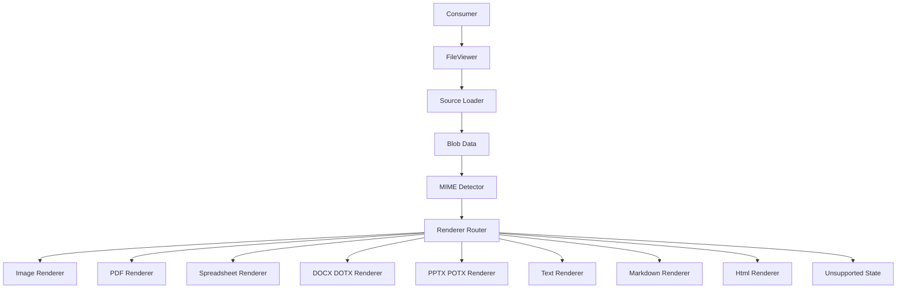
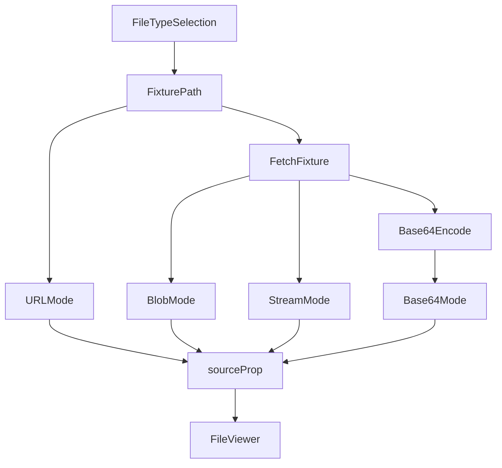

## Goal

Build a React file-viewer package that exports one simple component for images, spreadsheets, PDFs, Word documents, markdown, HTML (opt-in iframe preview), and labeled text files.

Supported v1 formats:

- Images: browser-native raster types (JPEG, PNG, GIF, WebP) plus classical TIFF (`image/tiff`), including multi-page TIFF rendered as a lazy-decoded vertical scroll stack (UTIF.js)
- Spreadsheets: `xlsx`, `xls`, `csv`
- Documents: `pdf`, `docx`, `dotx`, `pptx`, `potx`
- Text: `txt` and other text payloads when loaded MIME data identifies them as text
- Markdown: `text/markdown` and `text/x-markdown` via internal `MarkdownRenderer` (GFM + sanitize). Unlabeled markdown-looking blobs stay unsupported.
- HTML: `text/html` via internal `HtmlRenderer` only when `enableHtmlPreview` is true (sandboxed iframe with `allow-scripts`, no `allow-same-origin`). Default falls back to text renderer. No xhtml MIME in v1.

The document adapters use pinned Extend rendering primitives behind the package boundary: EmbedPDF with package-owned PDFium for PDF, `@extend-ai/react-docx` for DOCX/DOTX, `@extend-ai/react-xlsx` for XLSX/XLS, and `@extend-ai/react-pptx` for PPTX/POTX. PPTX is a static continuous preview with vendor toolbar, thumbnails, notes, and diagnostics disabled; FileViewer chrome remains the only control surface.

## Package Shape

The public package exports:

- `FileViewer`
- Public TypeScript types

Individual renderers are internal. Consumers do not choose renderers.

```tsx
<FileViewer source={source} />
```

```tsx
<FileViewer source={source} chrome="none" />
```

```tsx
<FileViewer source={source} chrome={MyChrome} />
```

`source` accepts a single raw value:

- `string`
- `Blob`
- `ReadableStream<Uint8Array>`

String sources are auto-classified in this order:

1. Data URL
2. Blob/object URL
3. HTTP(S) URL
4. Base64 string

Invalid or ambiguous strings fail through the normal unsupported/error path.

`chrome` accepts:

- `"default"` for built-in viewer chrome
- `"none"` for content-only presentation
- a React component that receives `FileViewerChromeApi`

## Data Flow



All sources are loaded to `Blob` before renderer selection. URLs and streams are buffered before rendering. No renderer is selected from consumer-supplied props.

## MIME Detection

Renderer selection depends on loaded data:

1. Unique binary magic (PDF, images, TIFF, OLE)
2. Specific loaded `Blob.type` or HTTP `Content-Type` (not generic: empty / `octet-stream` / `zip` / `x-zip-compressed`)
3. OpenXML package-root zip entry sniff (`ppt/` / `word/` / `xl/`)
4. Remaining MIME paths (markdown, HTML, textual types)

Filename extensions, consumer-provided MIME values, and text/CSV heuristics are not renderer-selection inputs.

That means these stay unsupported unless MIME/header data identifies them:

- unlabeled plain text `Blob`s
- unlabeled CSV `Blob`s

## Renderers

Renderers share a common internal contract:

- receive normalized loaded data
- report loading/ready/error status
- integrate with shared viewer state where relevant
- render fallback/error states through the package shell

PDFium WASM is emitted by the consumer's Vite build from the installed PDFium package, while its engine worker is package-owned. The PDF adapter resolves those local assets and disables EmbedPDF fallback-font networking, so the default renderer needs no CDN and works in an air-gapped deployment after normal package assets are served. XLSX/DOCX workers are bundler-managed by their adapters. The browser-only CSV grid and its vendor CSS are dynamically loaded together after mount, so no consumer `public`-asset or global CSS import step is required.

`dotx` uses the DOCX rendering path. Template metadata/actions are not executed.

## UI And Theming

The package uses Tailwind classes and follows the Mithya UI registry pattern.

`FileViewer` supports content-only presentation and host-owned chrome.

The shipped `chrome` API is:

```ts
type FileViewerChrome =
  | "default"
  | "none"
  | React.ComponentType<{ api: FileViewerChromeApi }>;
```

`FileViewerChromeApi` is discriminated by `api.file.kind`.

When `api.file.kind === "spreadsheet"`, custom chrome should branch on `api.file.mimeType`:

- `text/csv` has no workbook-level controls
- workbook-only controls like `sheetNames`, `activeSheetIndex`, and `setActiveSheetIndex` are only meaningful for non-CSV spreadsheet formats

The workbook adapter uses the lower-level `XlsxViewer` controller rather than an Extend viewer shell. FileViewer owns sheet names and active-sheet chrome, so consumer sheet commands remain bidirectional.

`@mithya/ui-registry` is a dev-time generator/CLI, not a runtime component library. The package should use the registry to generate or copy the needed design-system primitives into `packages/file-viewer/src`, then ship those primitives as package code.

The package must not import runtime components from `@mithya/ui-registry` or expect consumers to provide `@mithya/ui-repository` as a component peer dependency.

Right now the package does not ship a separate CSS or token artifact. Styling is handled with Tailwind classes and CSS variable fallbacks in component code. A packaged CSS/tokens output can be added later if needed.

Consumers must configure Tailwind to scan the package source/classes so library classes are emitted in host builds.

## Demo App

The demo app lives at `apps/demo`.

The demo is the package validation harness, not just a renderer playground. It should validate the full package contract end to end, including source modes, renderer behavior, fallback/error paths, and the built artifact shape consumers are expected to install.

Existing files from `sample-files` are copied into `apps/demo/public/sample-files` for Vite serving. The current demo fixture set includes `txt`, `csv`, `jpg`, `pdf`, `docx`, `dotx`, and `xlsx`. Some tooling views may omit binary fixtures; the on-disk demo folder is the source of truth.

Demo layout is a split pane:

- left pane: active `FileViewer` surface
- right pane: compact toolbar for file-type and source-mode switching

Right-pane controls are state-driven, not route-driven, so format/source transitions happen in place.

The demo should exercise:

- URL source
- Blob source
- Base64 source
- ReadableStream source
- Error/unsupported state
- built package artifact shape expected by consumers
- external PDF/PPTX page commands, including early and same-page commands through the citation-scroll route

### Demo Source Preparation Flow

For the selected file type, the demo resolves one fixture path and derives all source modes from it.



In URL mode, the demo passes an absolute URL (resolved against `window.location.origin`) to ensure URL classification follows the HTTP(S) string path.

Demo validation should cover both fast workspace-linked development and the built package shape that external consumers rely on, so packaging/export/style/worker issues are caught before release.


## Reference Material

`sample-renderers` is reference-only. It must not be imported, copied wholesale, or treated as source for the package.

## Runtime Support

Supported runtime is modern evergreen browsers with:

- `fetch`
- `Blob`
- `ReadableStream`
- module workers
- CSS variables

SSR-safe import is required. The viewer itself renders client-side.
